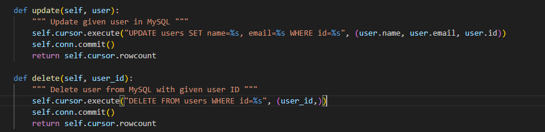
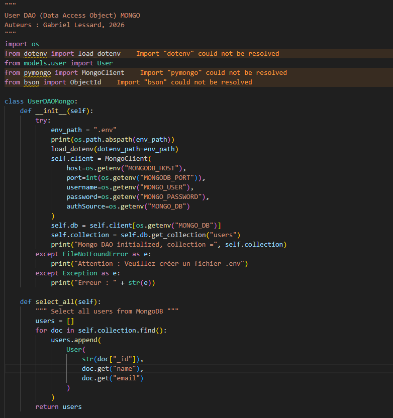
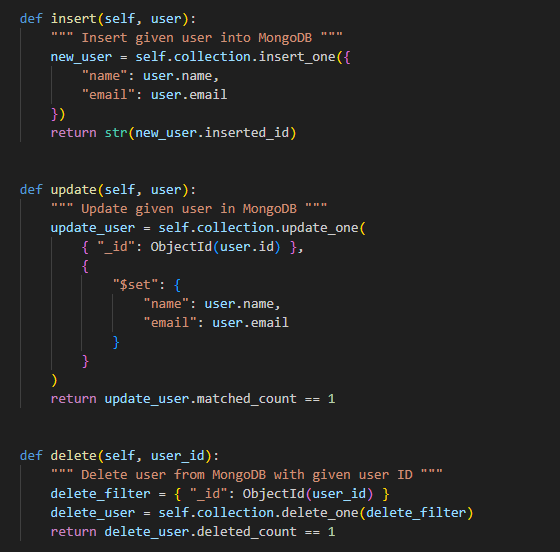
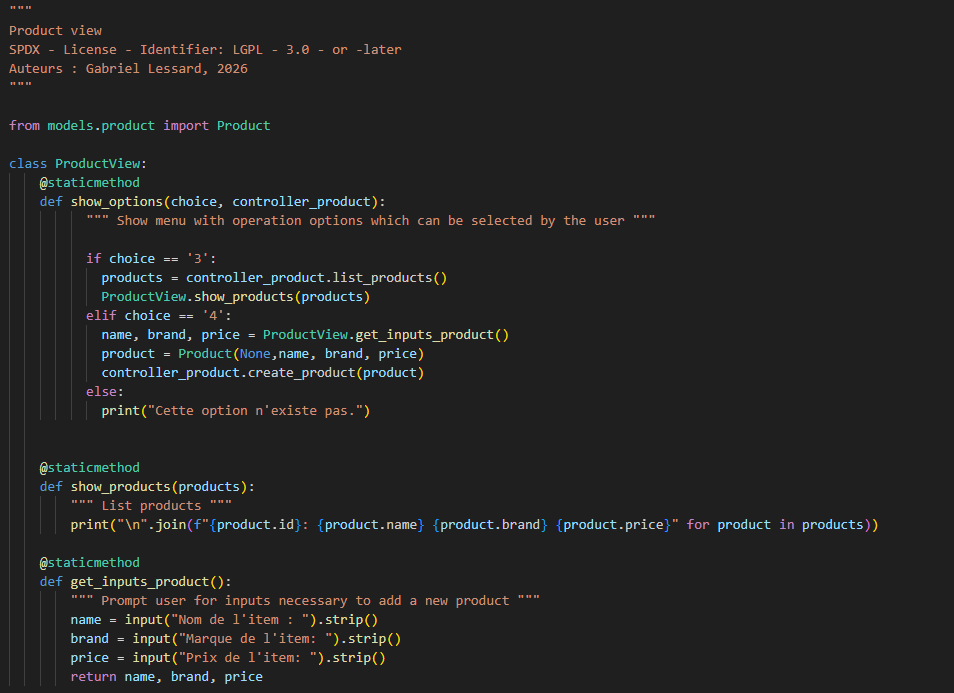
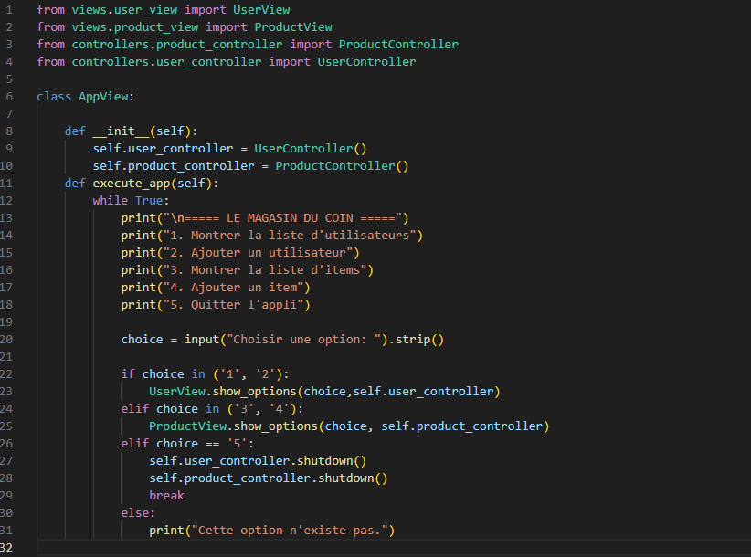

## Gabriel Lessard - 24 janvier 2026
### Labo 01 - LOG430

### Question 1 
Quelles commandes avez-vous utilisées pour effectuer les opérations UPDATE et DELETE dans MySQL ? Avez-vous uniquement utilisé Python ou également du SQL ? Veuillez inclure le code pour illustrer votre réponse.

La commande execute du curseur nous permet d’effectuer des commandes SQL sur les tables de la base de données.
De plus, la commande commit nous permet de confirmer les modifications que nous avons apportées à la table concernée.

### Question 2 
Quelles commandes avez-vous utilisées pour effectuer les opérations dans MongoDB ? Avez-vous uniquement utilisé Python ou également du SQL ? Veuillez inclure le code pour illustrer votre réponse.

MongoDB est un type de base de données qui utilise le format JSON (clé-valeur). Nous devons utiliser la librairie pymongo pour pouvoir accéder aux différentes méthodes. La syntaxe est différente et propre à ce système pour effectuer des opérations dans la base de données. Les tables y sont appelées des collections et pour réaliser les opérations SELECT, INSERT, UPDATE et DELETE, il faut utiliser respectivement les commandes find, insert_one, update_one et delete_one sur la collection souhaitée.

### Question 3 
Comment avez-vous implémenté votre product_view.py ? Est-ce qu’il importe directement la ProductDAO ? Veuillez inclure le code pour illustrer votre réponse.

Dans ce laboratoire, nous avons deux vues : une pour les users et une pour les products. Chacune possède ses propres méthodes pour effectuer des actions dans l’application. Cependant, j’ai regroupé ces deux vues dans un fichier nommé app_view.py, qui s’occupe de l’affichage et qui détermine la durée d’exécution de l’application en fonction des choix de l’utilisateur.

Il est important de préciser que les vues n’ont aucun accès direct au DAO, puisqu’elles n’ont techniquement pas conscience de son existence. Seuls les contrôleurs des deux modèles agissent comme des ponts afin d’effectuer les opérations nécessaires.
Vous trouverez ci-dessous, dans l’ordre, les fichiers product_view.py et app_view.py.

###  Question 4 
Si nous devions créer une application permettant d’associer des achats d'articles aux utilisateurs (Users → Products), comment structurerions-nous les données dans MySQL par rapport à MongoDB ?

Dans MySQL, pour créer une association, il faut conserver un attribut (ou une propriété) qui sert de lien entre deux tables afin de savoir quel produit a été acheté par quel utilisateur. En procédant ainsi, il devient facile de retracer la relation entre le produit et l’utilisateur concerné. Dans le cas de MongoDB, le principe est similaire. En utilisant ce que l’on appelle la méthode des références manuelles, on stocke l’identifiant de l’utilisateur (user_id) dans la collection products afin de créer l’association entre les deux entités.